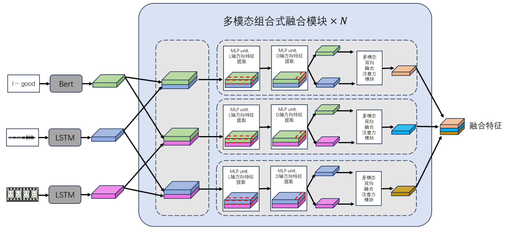
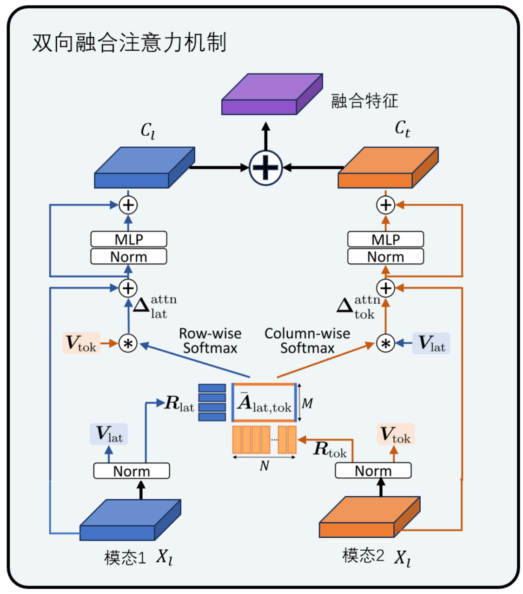
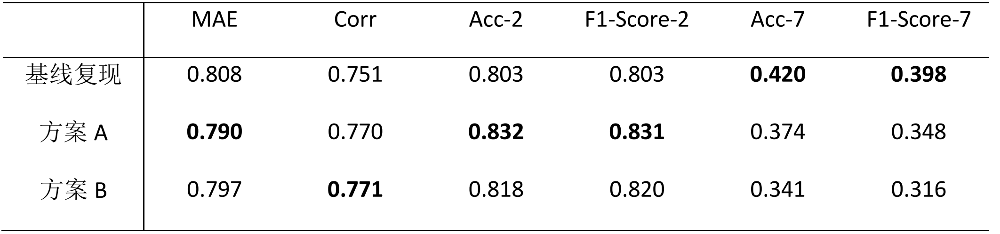

# 基于双向融合注意力的多模态多路特征融合方法

C_N_U IE的语音信号处理课程期末课程设计，我做的是语音-文本-视频多模态方法的情感识别。

C_N_U IE's final assignment for the Speech Signal Processing course, I did a speech-text-video multimodal approach to emotion recognition.


本项目基于<CubeMLP: A MLP-based Model for Multimodal Sentiment Analysis and Depression Estimation> (ACM MM 2022)开发并尝试改进改进方法，尝试使用多路模态融合+双向融合注意力机制的方式提升算法性能。

感谢作者开源CubeMLP基础代码[https://github.com/kiva12138/CubeMLP](https://github.com/kiva12138/CubeMLP)使我能快速入手。

本文主要改进为将CubeMLP的三种模态同时融合改为三种模态两两交叉组合，随后在每个组合特征上使用线性层作特征变换与融合，后将两个特征使用一种注意力的方式融合成单个特征图。可将前述模块重复N次，以提升深度。


<div style="center;">
    
</div>

双向融合注意力机制似乎是在arxiv上一篇论文中给出的，大概记得轮廓忘记哪篇了，细节如图所示，
<div style="center;">
    
</div>


The codes require the PyTorch and numpy installation.

部署参考[https://github.com/kiva12138/CubeMLP](https://github.com/kiva12138/CubeMLP)，推荐在kaggle服务器上运行。

To run the codes:
```
python Train.py --dataset mosi_SDK --batch_size 128 -- features_compose_t mean --features_compose_k cat --d_hiddens 50-2-128=10-2-32 --d_outs 50-2-128=10-2-32 --res_project 1-1 --bias --ln_first --dropout_mlp 0.1-0.1-0.1 --dropout 0.1-0.1-0.1-0.1 --bert_freeze part --bert_lr_rate 0.01 --learning_rate 4e-3
```

CubeMLP官方实现中提到

"
The final results may be slightly fluctuating, but the overall results should correspond to the metrics in the paper.(Sometimes, the results are even better than the paper's.)
"

确实在复现过程中效果略有低于论文中公布的指标，由于开源项目中未更详细描述部署环境，也没过于追究。
<div style="text-align:center;">
    
</div>

The processed MOSI and MOSEI dataset has been uploaded to Google Drive: https://drive.google.com/drive/folders/1MNp1qycJLfY87xUDouNU9gm2O5BsYRFE and Baidu Disk: https://pan.baidu.com/s/1CRbE4rPUhEfmCysuY4_q3A (Code: rif6).

